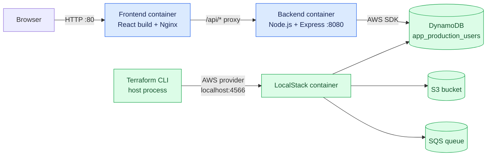
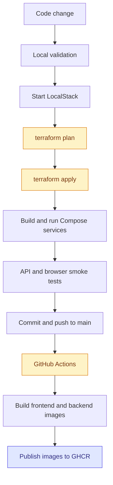
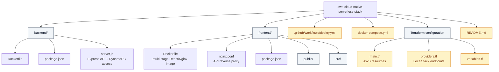
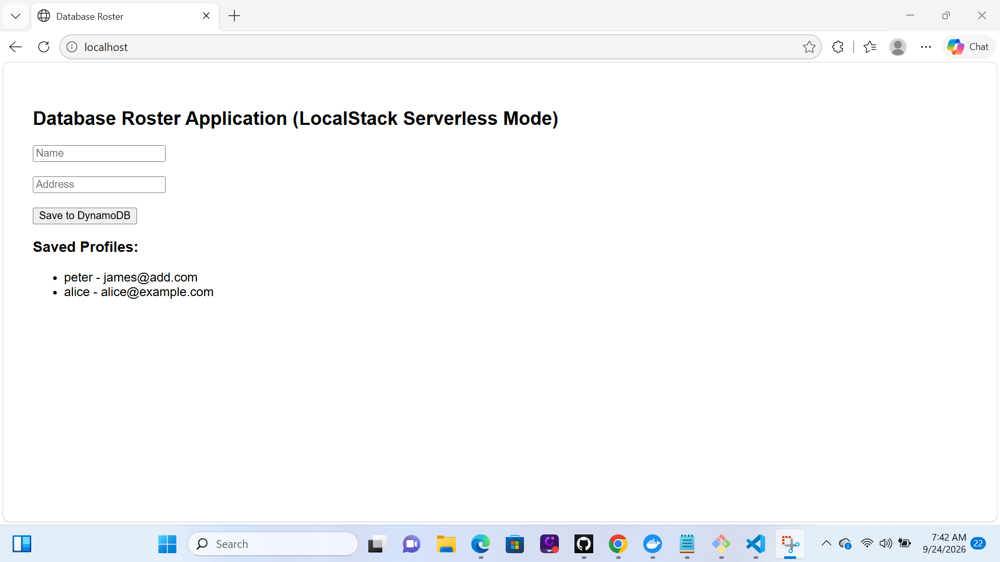
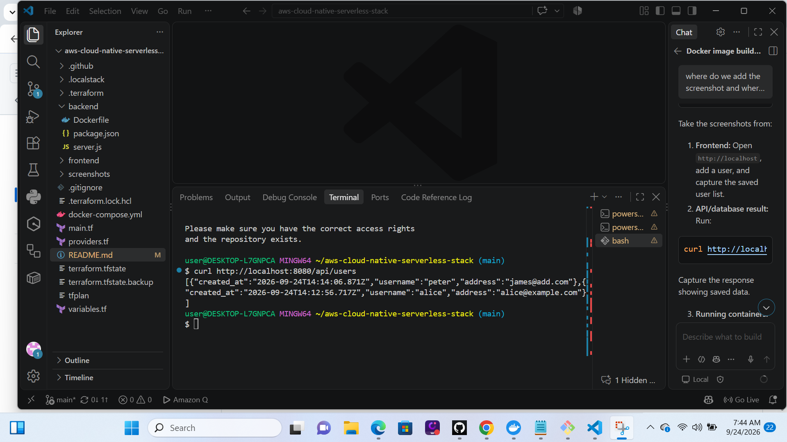
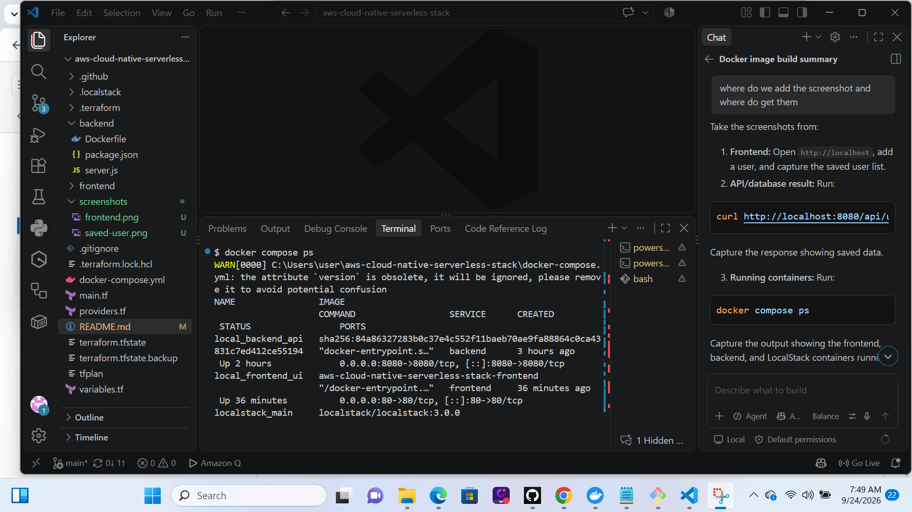
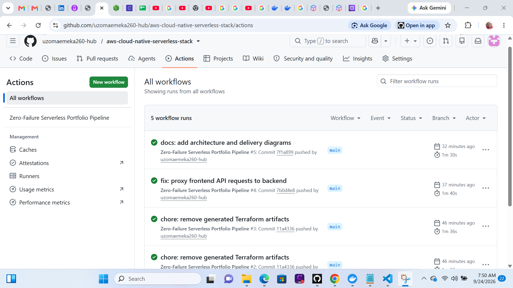

# AWS Cloud-Native Serverless Stack

A containerized full-stack reference application that combines a React frontend, an Express API, Terraform-managed AWS-compatible infrastructure, LocalStack, and GitHub Actions container publishing.

The project is designed to provide a repeatable local development and infrastructure workflow without requiring an AWS account. LocalStack emulates the AWS services, Terraform defines the infrastructure, Docker Compose runs the application, and GitHub Actions builds and publishes container artifacts to GitHub Container Registry.

## Project Purpose

This project simulates a production delivery workflow locally and at zero infrastructure cost. It provides a pre-production validation loop for building containers, provisioning AWS-compatible resources, deploying the application stack, and running smoke tests before promoting the same design to a real cloud environment.

The local workflow is intentionally separated into clear responsibilities:

- **Terraform:** Provision the infrastructure contract against LocalStack.
- **Docker Compose:** Build and run the frontend, backend, and AWS service emulator.
- **Smoke tests:** Verify the application can write and read user data through the API and DynamoDB-compatible service.
- **GitHub Actions:** Build and publish application images as the CI artifact stage.

This is a local pre-production simulation, not a claim of production deployment. A production promotion would add managed AWS services, remote encrypted Terraform state, secrets management, monitoring, alerting, deployment approvals, and a production runtime target.

## Architecture



The host-side Terraform provider uses `localhost:4566`; containers use the Compose network hostname `localstack_main:4566`. Nginx proxies browser requests from `/api/*` to the backend service so the browser uses one origin.

## Delivery Workflow



The current GitHub Actions workflow publishes images; it does not deploy them to a runtime environment. A production extension would add a deployment target, image promotion, environment approvals, and secret-backed cloud credentials.

## Cost-Optimization Strategy

The design separates validation cost from production cost:

| Stage | Platform | Cost strategy |
| --- | --- | --- |
| Local development | Docker Compose + LocalStack | No AWS spend; run services only when needed |
| Pull request validation | GitHub Actions | Validate Terraform, Compose, and container builds before merge |
| Main branch artifacts | GHCR | Publish versioned images using the commit SHA and a convenience `latest` tag |
| Production promotion | AWS or another cloud runtime | Select a right-sized managed or serverless target and apply budgets/alerts |

This makes the local loop inexpensive while preserving the controls that matter before production: repeatable infrastructure, build validation, traceable artifacts, and smoke tests. “Zero cost” applies to the local simulation; production cost depends on the selected runtime, traffic, retention, and managed services.

## Technology Stack

- **Frontend:** React 18, served from Nginx in a multi-stage Docker image
- **Backend:** Node.js, Express, AWS SDK for JavaScript
- **Infrastructure as Code:** Terraform with the AWS provider
- **AWS emulation:** LocalStack 3.0
- **Container orchestration:** Docker Compose
- **CI/CD:** GitHub Actions
- **Container registry:** GitHub Container Registry (GHCR)

## Repository Layout



Generated and machine-local files such as `.terraform/`, `tfplan`, `terraform.tfstate`, and `.localstack/` are intentionally excluded from source control.

## Portfolio Evidence

The repository demonstrates the following independently reviewable practices:

- **Infrastructure as Code:** Terraform defines DynamoDB, SQS, and S3 resources instead of requiring manual console setup.
- **Environment parity:** LocalStack provides an AWS-compatible local target while preserving the provider and SDK integration model.
- **Container boundaries:** Frontend, backend, and infrastructure emulation have separate containers with explicit network and dependency relationships.
- **Application routing:** Nginx serves the frontend and reverse-proxies API traffic to avoid browser cross-origin configuration in the local stack.
- **Repeatable delivery:** GitHub Actions builds both application images and publishes them to GHCR on changes to `main`.
- **Operational hygiene:** Generated Terraform providers, plans, state, and LocalStack data are excluded from Git to prevent secrets, machine state, and oversized binaries entering repository history.
- **Verification path:** The README documents a plan-before-apply workflow, API smoke tests, service logs, state-lock handling, and cleanup.

## Infrastructure Managed by Terraform

Terraform provisions the following resources inside LocalStack:

| Resource | Name | Purpose |
| --- | --- | --- |
| DynamoDB | `app_production_users` | Stores user records submitted through the API |
| SQS | `user-processing-queue` | Queue foundation for asynchronous processing |
| S3 | `portfolio-frontend-assets-bucket` | Storage foundation for static or frontend assets |

The current backend actively uses DynamoDB through `POST /api/users` and `GET /api/users`. The S3 bucket and SQS queue are provisioned infrastructure but are not currently used by application code.

## Prerequisites

Install and verify:

- Docker Desktop with Docker Compose
- Terraform 1.5 or newer
- Git
- Git Bash or PowerShell
- A GitHub repository with GitHub Packages enabled for the workflow

Verify the tools:

```bash
docker --version
docker compose version
terraform version
git --version
```

## Local Deployment Sequence

Run the following commands from the repository root.

### 1. Start LocalStack

Start the AWS-compatible service emulator before running Terraform:

```bash
docker compose up -d localstack
```

Confirm that LocalStack is healthy:

```bash
docker compose ps
```

The expected LocalStack endpoint is `http://localhost:4566`.

### 2. Initialize Terraform

Download the provider and initialize the working directory:

```bash
terraform init
```

### 3. Review the infrastructure plan

Generate a saved plan before applying infrastructure changes:

```bash
terraform plan -out=tfplan
```

### 4. Apply the infrastructure

Apply the reviewed plan:

```bash
terraform apply tfplan
```

For a non-interactive local run, use:

```bash
terraform apply -auto-approve
```

Terraform runs on the host machine and connects to LocalStack through `localhost:4566`. Terraform is not currently running inside a container.

### 5. Start the application containers

Start the backend and frontend after the infrastructure is available:

```bash
docker compose up -d backend frontend
```

Alternatively, start the complete stack in one command:

```bash
docker compose up -d
```

Check service state and published ports:

```bash
docker compose ps
```

### 6. Access the application

- Frontend: http://localhost
- Backend API: http://localhost:8080
- LocalStack: http://localhost:4566

## API Smoke Test

Create a user:

```bash
curl -X POST http://localhost:8080/api/users \
  -H "Content-Type: application/json" \
  -d '{"username":"alice","address":"alice@example.com"}'
```

List users:

```bash
curl http://localhost:8080/api/users
```

## Docker Compose Operations

View container status:

```bash
docker compose ps
```

Follow application logs:

```bash
docker compose logs -f backend frontend
```

Rebuild application images after source or dependency changes:

```bash
docker compose up -d --build backend frontend
```

Stop containers while preserving LocalStack data in `.localstack`:

```bash
docker compose down
```

Stop containers and remove the LocalStack volume data:

```bash
docker compose down -v
```

## Terraform State and Locking

Terraform currently uses local state in `terraform.tfstate`. The project does not yet configure an S3 remote backend or DynamoDB state locking table.

The Terraform-created S3 bucket and DynamoDB table are application resources, not Terraform backend resources.

Only run one Terraform command that modifies state at a time. If an apply is interrupted, check for active Terraform processes before retrying.

In Git Bash, check for running Terraform processes:

```bash
tasklist.exe | grep -i terraform
```

Inspect the Terraform command line:

```bash
powershell.exe -NoProfile -Command "Get-CimInstance Win32_Process -Filter \"Name = 'terraform.exe'\" | Select-Object ProcessId,CommandLine"
```

If a confirmed stale process remains, stop its specific process ID:

```bash
taskkill.exe //PID <PROCESS_ID> //F
```

Do not use `-lock=false` as a routine workaround. It can allow concurrent writes and corrupt local state.

## CI/CD Pipeline

The workflow at `.github/workflows/deploy.yml` runs when code is pushed to `main`.

It currently:

1. Checks out the repository.
2. Authenticates to GHCR using the built-in `GITHUB_TOKEN`.
3. Builds and publishes the frontend image.
4. Builds and publishes the backend image.

On pushes to `main`, the images are published as:

```text
ghcr.io/<owner>/<repository>/app-frontend:latest
ghcr.io/<owner>/<repository>/app-backend:latest
ghcr.io/<owner>/<repository>/app-frontend:<commit-sha>
ghcr.io/<owner>/<repository>/app-backend:<commit-sha>
```

Pull requests run Terraform formatting/validation, Compose configuration validation, and container builds without publishing images. The current workflow does not deploy LocalStack or a production host. Docker Compose builds from local source directories, so it does not automatically pull the GHCR images.

## Development-to-CI Workflow

Validate locally before pushing:

```bash
docker compose up -d localstack
terraform init
terraform plan -out=tfplan
terraform apply tfplan
docker compose up -d backend frontend
docker compose ps
```

Commit and push after the local smoke test passes:

```bash
git add .
git commit -m "Describe the change"
git push origin main
```

The push triggers GitHub Actions, which builds and publishes the container images. A production deployment would require a separate runtime target, such as an EC2 host, ECS, Kubernetes, or another container platform, to pull and run those images.

## Design and Operational Notes

- LocalStack uses mock AWS credentials and should remain isolated to local development and CI test environments.
- The AWS provider is configured for the `us-east-1` region and LocalStack endpoints.
- S3 path-style addressing is enabled for LocalStack compatibility.
- The LocalStack data directory is mounted at `.localstack` so local service data survives a normal `docker compose down`.
- The current CI workflow uses the mutable `latest` tag. A production-grade release pipeline should also publish immutable commit-SHA or semantic-version tags and deploy only a verified tag.
- A production Terraform backend should use remote state with locking and encrypted storage rather than the local `terraform.tfstate` file.
- Terraform plan artifacts should be reviewed before apply in shared or production environments.

## Troubleshooting

### LocalStack is not healthy

Check status and logs:

```bash
docker compose ps
docker compose logs -f localstack
```

Restart only LocalStack:

```bash
docker compose restart localstack
```

### Terraform cannot connect to LocalStack

Confirm port `4566` is published and LocalStack is healthy:

```bash
docker compose ps localstack
```

### Terraform reports a state lock

Confirm that no apply or plan is still running:

```bash
tasklist.exe | grep -i terraform
```

Stop only a confirmed stale Terraform process, then retry the command:

```bash
taskkill.exe //PID <PROCESS_ID> //F
```

### Application containers cannot reach LocalStack

The backend uses the Compose service hostname `localstack_main:4566` from inside the Docker network. The host-side Terraform provider uses `localhost:4566`. These addresses are intentionally different because they are evaluated from different network contexts.

## Cleanup

Destroy Terraform-managed LocalStack resources:

```bash
terraform destroy
```

Stop the containers:

```bash
docker compose down
```

Remove LocalStack's persisted local data only when a clean environment is required:

```bash
docker compose down -v
```
## Evidence

### Application



### Persisted API data



### Docker Compose services



### GitHub Actions

